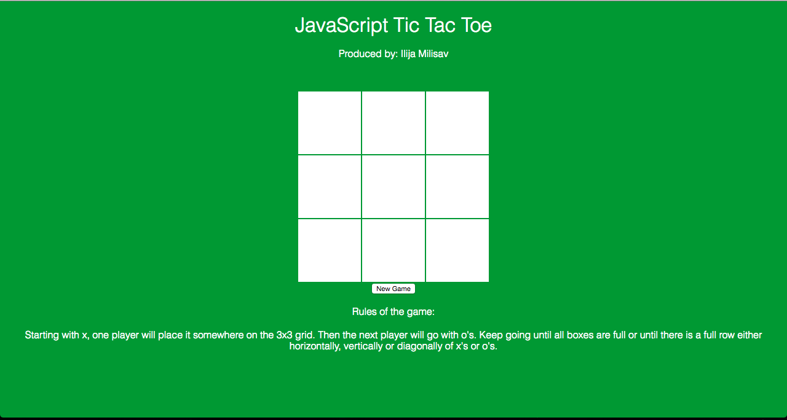

# JavaScript TicTacToe

Using JavaScript, I implemented the game of TicTacToe. 

I styled the webpage using CSS.

Both CSS and JavaScript is embedded within the HTML page.

----------

Future Endeavours would be:

- implementing a winner check
- implementing a TicTacToe AI

----------

The webpage looks like the following:

